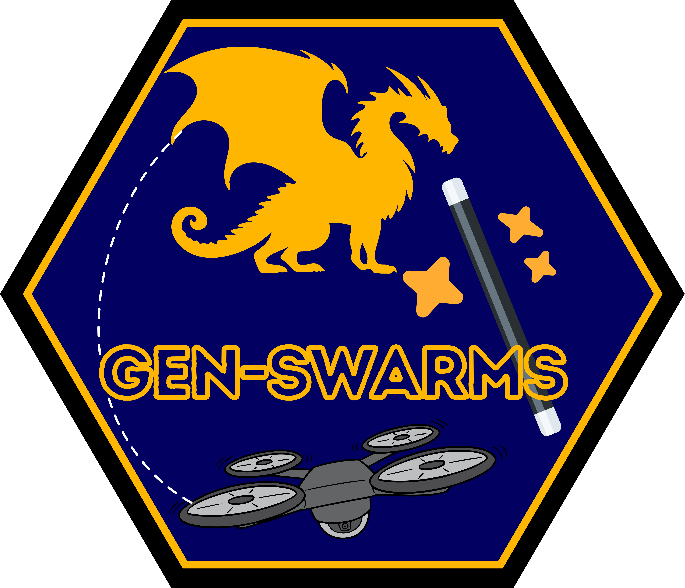

<h1 align="center">Gen-Swarms: Adapting Deep Generative Models to Swarms of Drones</h1>

<div align="center">
    
</div>

<h3 align="center">ECCV 2024 | MAAS Workshop</h3>
 <div align="center">
    <a href="https://cplou99.github.io/web/" target="_blank">Carlos Plou*</a>,
    <a href="https://sites.google.com/unizar.es/pablo-pueyo/inicio?authuser=1" target="_blank">Pablo Pueyo*</a>,
    <a href="https://webdiis.unizar.es/~rmcantin/" target="_blank">Ruben Martinez-Cantin</a>,
    <a href="https://web.stanford.edu/~schwager/" target="_blank">Mac Schwager</a>,
    <a href="https://sites.google.com/unizar.es/anac/home?authuser=0" target="_blank">Ana C. Murillo</a>,
    <a href="https://sites.google.com/unizar.es/eduardo-montijano" target="_blank">Eduardo Montijano</a>
</div>


<div align="center">
   <a href="https://longvideobench.github.io/"><strong>Homepage</strong></a> | <a href="docs/ECCVWMAAS2024.png"><strong>Poster</strong></a> |  <a href="https://arxiv.org/abs/2408.15899"><strong>ArXiv</strong></a>
   </div>   


## Clone the repository and install dependencies

Clone the repository.
```bash
git clone https://github.com/cplou99/Gen-Swarms
```

Install all packages via conda environment YAML file.

```bash
# Create the environment
conda env create -f env.yml
# Activate the environment
conda activate gen-swarms
```

Install RVO2-3D Library which is an easy-to-use C++ implementation of the optimal reciprocal collision avoidance [(ORCA)](https://gamma.cs.unc.edu/ORCA/) formulation
```bash
git clone https://github.com/mtreml/Python-RVO2-3D
cd Python-RVO2-3D
python setup.py build
python setup.py install
```

## Dataset and checkpoints

Dataset is available at [data folder](https://drive.google.com/drive/folders/1Su0hCuGFo1AGrNb_VMNnlF7qeQwKjfhZ) of diffusion-point-cloud paper. Please, download and locate the `shapenet.hdf5` file inside the `data` folder of Gen-Swarms repository.

Some checkpoints are located at `logs_gen` folder.

## Training

```bash
# Train a generator
python train_gen.py
```

You may specify the value of arguments. Please find the available arguments in the script. By default, new checkpoints will be saved at `logs_gen` folder.

Note that `--categories` can take `all` (use all the categories in the dataset), `airplane`, `chair` (use a single category), or `airplane,chair` (use multiple categories, separated by commas).


## Testing
To generate some pointclouds with their trajectories from a trained model, please run.

```bash
# Test a generator
python test_gen.py --ckpt ./logs_gen/gen-swarms_airplane.pt --categories airplane --num_gen_samples 10
```

Results will be saved at `results` folder. If you want to replicate the results of the paper, please run with `--num_gen_samples None`.
You may find some additional scripts inside `show` folder to visualize results.

## Citation
```
@misc{plou2024genswarmsadaptingdeepgenerative,
      title={Gen-Swarms: Adapting Deep Generative Models to Swarms of Drones}, 
      author={Carlos Plou and Pablo Pueyo and Ruben Martinez-Cantin and Mac Schwager and Ana C. Murillo and Eduardo Montijano},
      year={2024},
      eprint={2408.15899},
      archivePrefix={arXiv},
      primaryClass={cs.RO},
      url={https://arxiv.org/abs/2408.15899}, 
}
```
